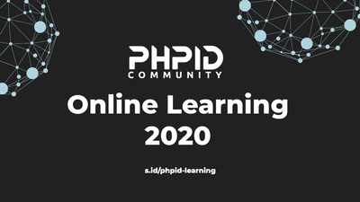

# phpid-online-learning-2020

  

## Data bisa juga diakses lewat

- Web UI: [s.id/phpid-learning](https://s.id/phpid-learning)
- JSON: Lihat berkas [data.json](data.json)
- [Carik Bot](https://carik.id/) keyword: jadwal event phpid

## Daftar online learning
- [#43 Anak IT merasa salah jurusan?](#anak-it-merasa-salah-jurusan)
- [#42 Ask Me Anything with Om Luri Darmawan](#Ask-me-anything-with-om-luri-darmawan)
- [#41 Belajar Konsep CRM & Menggunakan Software CRM Gratis](#belajar-konsep-crm--menggunakan-software-crm-gratis)
- [#40 The Journey of Test-Driven Development](#the-journey-of-test-driven-development)
- [#39 Mendeploy Situs Wordpress yang Scalable di AWS](#mendeploy-situs-wordpress-yang-scalable-di-aws)
- [#38 Developer Jadi Pengajar, why not?](#developer-jadi-pengajar-why-not)
- [#37 2021, PHP masih cocok untuk dipelajari?](#2021-php-masih-cocok-untuk-dipelajari)
- [#36 Membuat Aplikasi PHP Microservices dengan AWS](#membuat-aplikasi-php-microservices-dengan-aws) (cancelled)
- [#35 Enabling Data Governance](#enabling-data-governance)
- [#34 Why developer must care about Open Source?](#why-developer-must-care-about-open-source)
- [#33 Web Accessibility](#web-accessibility)
- [#32 Python For Data Science](#python-for-data-science)
- [#31 Software Estimation Jump Start](#software-estimation-jump-start)
- [#30 Scaling Application to 1 Millions Users](#scaling-application-to-1-millions-users)
- [#29 The Change Maker Framework](#the-change-maker-framework)
- [#28 Ngobrol Santai Bareng om Peter & 2 Jam bikin Absensi Online](#ngobrol-santai-bareng-om-peter---2-jam-bikin-aplikasi-absensi-online)
- [#27 Ngobrol Santai Bareng om Sony Kurniawan](#ngobrol-santai-bareng-om-sony-kurniawan)
- [#23 Live Coding Music - Write Music with Code](#live-coding-music-write-music-with-code)
- [#24 Pengembangan Sistem Informasi eGovernment](#pengembangan-sistem-informasi-egovernment) (cancelled)
- [#26 Codepolitan](#codepolitan)
- [#25 PostgreSQL: DDL dan SQL](#postgreSQL-ddl-dan-sql)
- [#22 The Practical Guide howto become System Analyst](#the-practical-guide-howto+become-system-analyst)
- [#21 Linux Server for PHP Developer](#linux-server-for-php-developer)
- [#20 Do it with SQL - Journey to the Center of Database World](#do-it-with-sql-journey-to-the-center-of-database-world)
- [#19 Personal Security Awareness](#personal-security-awareness)
- [#18 Web RTC](#web-rtc)
- [#17 How to Secure your Next Job During Covid-19 Pandemic](#how-to-secure-your-next-job-during-covid-19-pandemic)
- [#16 Evolution Of PHP](#evolution-of-php)
- [#15 Rest API dengan PHP OOP](#rest-api-dengan-php-oop)
- [#14 Tactics and Strategy to Define Digital Products](#tactics-and-strategy-to-define-digital-product)
- [#13 Remote Worker](#remote-worker)
- [#12 Berkarir sebagai Frontend Developer](#berkarir-sebagai-frontend-developer)
- [#11 Starting Your Career in the Data Science](#starting-your-career-in-the-data-science)
- [#10 Optimize Image on Your Website 101](#optimize-image-on-your-website-101)
- [#9 Building CI/CD Pipeline](#building-cicd-pipeline)
- [#8 Social Media Digital Strategy](#social-media-digital-strategy)
- [#7 Laravel LiveWire 101](#laravel-livewire-101)
- [#6 Migration from Procedural to OOP](#migration-from-procedural-to-oop)
- [#5 Why Documentation Matter](#why-documentation-matter)
- [#4 Kinerja Web 101](#kinerja-web-101)
- [#3 SEO Basic](#seo-basic)
- [#2 Coder Journey to UI/UX Galaxy](#coder-journey-to-uiux-galaxy)
- [#1 How to design a good database](#how-to-design-a-good-database)

### Template sesi selanjutnya

- Waktu: Hari, XX Juli 2020
- Pukul: 19:00
- Pemateri: empty
- Slide: empty
- Video: empty
- Registrasi: coming soon
- Sesi: 42
- Deskripsi: -

### Anak IT merasa salah jurusan?

- Waktu: Sabtu, 1 Agustus 2020
- Pukul: 19:00
- Pemateri: Anne Regina
- Slide: empty
- Video: empty
- Registrasi: https://us02web.zoom.us/meeting/register/tZIlfuCsqDIsG920wfiveGUMKrBoOrC4dbDs
- Sesi: 43
- Deskripsi: 

### Ask Me Anything with Om Luri Darmawan

- Waktu: Sabtu, 25 Juli 2020
- Pukul: 19:00
- Pemateri: Luri Darmawan
- Slide: empty
- Video: https://web.facebook.com/peterjkambey/videos/10220255840643962/
- Registrasi: empty
- Sesi: 42
- Deskripsi: Ask Me Anything with om Luri Darmawan. Founder Carik ChatBot paling fenomenal 2020 didaftar di 1000 group telegram/wa/line/messenger.

### Belajar Konsep CRM & Menggunakan Software CRM Gratis

- Waktu: Kamis, 16 Juli 2020
- Pukul: 19:00
- Pemateri: Arga Dinata
- Slide: https://www.facebook.com/groups/phpid/permalink/10158405253286101/
- Video: https://www.facebook.com/peterjkambey/videos/10220185761212020
- Registrasi: empty
- Sesi: 41
- Deskripsi: Om Arga Dinata, Konsultan Senior yang banyak menggarap proyek2 CRM di perusahaan-perusahaan terkenal

### The Journey of Test-Driven Development

- Waktu: Selasa, 14 Juli 2020
- Pukul: 19:00
- Pemateri: Freddy Munandar - Sarccom
- Slide: https://www.linkedin.com/posts/activity-6688998406926536704-KmYM
- Video: https://www.facebook.com/peterjkambey/videos/10220170296345408
- Registrasi: empty
- Sesi: 40
- Deskripsi: Om Freddy Founder Senior Developer, Founder/Pengurus SARCCOM - Software Architect Indonesia Community

### Mendeploy Situs Wordpress yang Scalable di AWS

- Waktu: Kamis, 9 Juli 2020
- Pukul: 19:00
- Pemateri: Petra Novandi Barus
- Slide: empty
- Video: https://www.facebook.com/peterjkambey/videos/10220133445224153
- Registrasi: empty
- Sesi: 39
- Deskripsi: -

### Developer Jadi Pengajar, Why Not?

- Waktu: Sabtu, 4 Juli 2020
- Pukul: 19:00
- Pemateri: Galih Pratama
- Slide: empty
- Video: https://www.facebook.com/peterjkambey/videos/10220092304035649
- Registrasi: empty
- Sesi: 38
- Deskripsi: -

### 2021, PHP masih cocok untuk dipelajari?

- Waktu: Sabtu, 27 Juni 2020
- Pukul: 19:00
- Pemateri: Muhamad Surya Iksanudin
- Slide: empty
- Video: https://www.facebook.com/peterjkambey/videos/10220026566992264
- Registrasi: empty
- Sesi: 37
- Deskripsi: -

### Membuat Aplikasi PHP Microservices dengan AWS (cancelled)

- Waktu: Senin, 29 Juni 2020
- Pukul: 19:00
- Pemateri: Om Petra Novandi Barus - AWS
- Slide: empty
- Video: empty
- Registrasi: empty
- Sesi: 36
- Deskripsi: -

### Enabling Data Governance

- Waktu: Sabtu, 20 Juni 2020
- Pukul: 19:00
- Pemateri: Om Eryk Pratama
- Slide: empty
- Video: https://www.facebook.com/peterjkambey/videos/10219963481295161
- Registrasi: empty
- Sesi: 35
- Deskripsi: -

### Why developer must care about Open Source?

- Waktu: Minggu, 14 Juni 2020
- Pukul: 19:00
- Pemateri: Om Munir AP
- Slide: empty
- Video: https://www.facebook.com/peterjkambey/videos/10219914973922507
- Registrasi: empty
- Sesi: 34
- Deskripsi: -

### Web Accessibility

- Waktu: Sabtu, 13 Juni 2020
- Pukul: 19:00
- Pemateri: Om Prayudi Utomo
- Slide: empty
- Video: https://www.facebook.com/peterjkambey/videos/10219888776907598
- Registrasi: empty
- Sesi: 33
- Deskripsi: -

### Python For Data Science

- Waktu: Kamis, 11 Juni 2020
- Pukul: 19:00
- Pemateri: Om Firman Brillian
- Slide: empty
- Video: https://www.facebook.com/peterjkambey/videos/10219888776907598
- Registrasi: empty
- Sesi: 32
- Deskripsi: -

### Software Estimation Jump Start

- Waktu: Selasa, 9 Juni 2020
- Pukul: 19:00
- Pemateri: Om Buyung Bahari
- Slide: empty
- Video: https://www.facebook.com/peterjkambey/videos/10219872592703003
- Registrasi: empty
- Sesi: 31
- Deskripsi: -

### Scaling Application to 1 Millions Users

- Waktu: Senin, 8 Juni 2020
- Pukul: 19:00
- Pemateri: Om Petra Novandi Barus - AWS
- Slide: empty
- Video: https://www.facebook.com/peterjkambey/videos/10219864037649132
- Registrasi: empty
- Sesi: 30
- Deskripsi: -

### The Change Maker Framework

- Waktu: Sabtu, 6 Juni 2020
- Pukul: 19:00
- Pemateri: Om Steven Salim
- Slide: empty
- Video: https://www.facebook.com/peterjkambey/videos/10219845832474014
- Registrasi: empty
- Sesi: 29
- Deskripsi: -

### Ngobrol Santai Bareng om Peter - 2 Jam Bikin Aplikasi Absensi Online

- Waktu: Senin, 1 Juni 2020
- Pukul: 18:00
- Pemateri: om Peter Kambey - Om Nur Hidayat
- Slide: empty
- Video: https://www.facebook.com/peterjkambey/videos/10219798560652248
- Registrasi: empty
- Sesi: 28
- Deskripsi: -

### Ngobrol Santai Bareng om Sony Kurniawan

- Waktu: Senin, 18 Mei 2020
- Pukul: 16:00
- Pemateri: om Sony A Kurniawan
- Slide: empty
- Video: https://www.facebook.com/peterjkambey/videos/10219674327906507
- Registrasi: empty
- Sesi: 27
- Deskripsi: -

### Live Coding Music - Write Music with Code

- Waktu: Minggu, 17 Mei 2020
- Pukul: 16:30
- Pemateri: om Sastra Nababan
- Slide: empty
- Video: https://www.facebook.com/peterjkambey/videos/10219664721066342
- Registrasi: empty
- Sesi: 23
- Deskripsi: -

### Pengembangan Sistem Informasi eGovernment (cancelled)

- Waktu: Sabtu, 16 Mei 2020
- Pukul: 16:00
- Pemateri: om Stenly Karouw
- Slide: empty
- Video: empty
- Registrasi: empty
- Sesi: 24
- Deskripsi: -

### Codepolitan

- Waktu: Jumat, 15 Mei 2020
- Pukul: 16:00
- Pemateri: om Kresna Galuh
- Slide: https://docs.google.com/presentation/d/1Z4LHVF4_PRM0D1iHjdPiGaETyBS0kfbLoVT3vckabB0/edit?usp=sharing
- Video: https://www.facebook.com/peterjkambey/videos/10219644689445564
- Registrasi: empty
- Sesi: 26
- Deskripsi: -

### PostgreSQL: DDL dan SQL

- Waktu: Kamis, 14 Mei 2020
- Pukul: 16:00
- Pemateri: om Abdul Hadi
- Slide: empty
- Video: https://www.facebook.com/peterjkambey/videos/10219634513351168
- Registrasi: empty
- Sesi: 25
- Deskripsi: -

### The Practical Guide howto become System Analyst

- Waktu: Senin, 11 Mei 2020
- Pukul: 16:00
- Pemateri: Ibu Falahah - Dosen Univ. Telkom Bandung
- Slide: https://speakerdeck.com/flash68/system-analyst-short-guide
- Video: https://www.facebook.com/peterjkambey/videos/10219608505780995
- Registrasi: empty
- Sesi: 22
- Deskripsi: -

### Linux Server for PHP Developer

- Waktu: Sabtu, 9 Mei 2020
- Pukul: 16:00
- Pemateri: om Musa Amin
- Slide: https://musaamin.web.id/wp-content/uploads/2020/05/Linux-Server-untuk-Aplikasi-PHP.pdf
- Video: https://www.facebook.com/peterjkambey/videos/10219586488470576
- Registrasi: empty
- Sesi: 21
- Deskripsi: -

### Do it with SQL - Journey to the Center of Database World

- Waktu: Jumat, 8 Mei 2020
- Pukul: 16:00
- Pemateri: om Nur Hidayah
- Slide: https://www.slideshare.net/hidayat365/do-it-with-sql-journey-to-the-center-of-database-worlds
- Video: https://www.facebook.com/peterjkambey/videos/10219575493195701
- Registrasi: empty
- Sesi: 20
- Deskripsi: -

### Personal Security Awareness

- Waktu: Kamis, 7 Mei 2020
- Pukul: 16:00
- Pemateri: om Dyan Galih
- Slide: empty
- Video: https://www.facebook.com/peterjkambey/videos/10219564541841924
- Registrasi: empty
- Sesi: 19
- Deskripsi: -

### Web RTC

- Waktu: Rabu, 6 Mei 2020
- Pukul: 16:30
- Pemateri: Om Fitra Aditya
- Slide: https://docs.google.com/presentation/d/1rT4BSSXCYEzF9eCQJ1Bbnr65p2LZtMndrENzNQNN4Q8/edit?usp=sharing
- Video: https://www.facebook.com/peterjkambey/videos/10219553693850731
- Registrasi: empty
- Sesi: 18
- Deskripsi: -

### How to Secure your Next Job During Covid-19 Pandemic

- Waktu: Selasa, 5 Mei 2020
- Pukul: 16:30
- Pemateri: Ali Pasha - GeekHunter
- Slide: empty
- Video: https://www.facebook.com/peterjkambey/videos/10219542443169471
- Registrasi: empty
- Sesi: 17
- Deskripsi: -

### Evolution Of PHP

- Waktu: Senin, 4 Mei 2020
- Pukul: 16:00
- Pemateri: om Prasetyo Wicaksono
- Slide: empty
- Video: https://www.facebook.com/peterjkambey/videos/10219532379837894
- Registrasi: empty
- Sesi: 16
- Deskripsi: -

### Rest API dengan PHP OOP

- Waktu: Minggu, 3 Mei 2020
- Pukul: 16:30
- Pemateri: Shindu Samodra
- Slide: empty
- Video: https://www.facebook.com/peterjkambey/videos/10219521400483417
- Registrasi: empty
- Sesi: 15
- Deskripsi: -

### Tactics and Strategy to Define Digital Products

- Waktu: Sabtu, 2 Mei 2020
- Pukul: 16:30
- Pemateri: Agit Naeta
- Slide: empty
- Video: https://www.facebook.com/peterjkambey/videos/10219510663695004
- Registrasi: empty
- Sesi: 14
- Deskripsi: -

### Remote Worker

- Waktu: Kamis, 30 April 2020
- Pukul: 16:30
- Pemateri: Om Frangky Tumiwan
- Slide: empty
- Video: https://www.facebook.com/peterjkambey/videos/10219491497055850
- Registrasi: empty
- Sesi: 13
- Deskripsi: -

### Berkarir sebagai Frontend Developer

- Waktu: Selasa, 28 April 2020
- Pukul: 16:30
- Pemateri: Randy Vianda Putra
- Slide: https://speakerdeck.com/randyviandaputra/berkarir-sebagai-frontend-developer
- Video: https://www.facebook.com/peterjkambey/videos/10219471755322319
- Registrasi: empty
- Sesi: 12
- Deskripsi: -

### Starting Your Career in the Data Science

- Waktu: Minggu, 26 April 2020
- Pukul: 16:30
- Pemateri: Firman Brilian
- Slide: empty
- Video: https://www.facebook.com/peterjkambey/videos/10219460519601433
- Registrasi: empty
- Sesi: 11
- Deskripsi: -

### Optimize Image on Your Website 101

- Waktu: Sabtu, 25 April 2020
- Pukul: 16:30
- Pemateri: Munir AP
- Slide: empty
- Video: https://www.facebook.com/peterjkambey/videos/10219439233869303
- Registrasi: empty
- Sesi: 10
- Deskripsi: -

### Building CI/CD Pipeline

- Waktu: Jumat, 24 April 2020
- Pukul: 16:30
- Pemateri: Petra Barus
- Slide: empty
- Video: https://www.facebook.com/peterjkambey/videos/10219428640684480
- Registrasi: empty
- Sesi: 9
- Deskripsi: -

### Social Media Digital Strategy

- Waktu: Rabu, 22 April 2020
- Pukul: 19:30
- Pemateri: Fadhil Zikri Muhammad
- Slide: empty
- Video: https://www.facebook.com/peterjkambey/videos/10219410023379059
- Registrasi: empty
- Sesi: 8
- Deskripsi: -

### Laravel LiveWire 101

- Waktu: Minggu, 19 April 2020
- Pukul: 19:30
- Pemateri: Muhammad Amirul Ihsan
- Slide: empty
- Video: https://www.facebook.com/peterjkambey/videos/10219376923231576
- Registrasi: empty
- Sesi: 7
- Deskripsi: -

### Migration from Procedural to OOP

- Waktu: Kamis, 16 April 2020
- Pukul: 19:30
- Pemateri: Achmad Mardiansyah
- Slide: empty
- Video: https://www.facebook.com/peterjkambey/videos/10219344732706833
- Registrasi: empty
- Sesi: 6
- Deskripsi: -

### Why Documentation Matter

- Waktu: Rabu, 15 April 2020
- Pukul: 19:30
- Pemateri: Wiguno
- Slide: empty
- Video: https://www.facebook.com/peterjkambey/videos/10219333692590837
- Registrasi: empty
- Sesi: 5
- Deskripsi: -

### Kinerja Web 101

- Waktu: Selasa, 14 April 2020
- Pukul: 19:30
- Pemateri: Irfan Maulana
- Slide: https://speakerdeck.com/mazipan/kinerja-web-101
- Video: https://www.facebook.com/peterjkambey/videos/10219322209183759
- Registrasi: empty
- Sesi: 4
- Deskripsi: -

### SEO Basic

- Waktu: Minggu, 12 April 2020
- Pukul: 19:30
- Pemateri: Arbahud Rio Daroyni
- Slide: https://www.linkedin.com/posts/arbahud-rio-daroyni-062100146_step-by-step-belajar-seo-dasar-activity-6655336421471158272-Sbw5
- Video: https://youtu.be/emfHRGd5LuE
- Registrasi: empty
- Sesi: 3
- Deskripsi: -

### Coder Journey to UI/UX Galaxy

- Waktu: Jumat, 10 April 2020
- Pukul: 19:30
- Pemateri: Prayudi Utomo
- Slide: https://speakerdeck.com/yudiutomo/ux-introduction
- Video: https://www.facebook.com/peterjkambey/videos/10219281729691797
- Registrasi: empty
- Sesi: 2
- Deskripsi: -

### How to design a good database

- Waktu: Kamis, 9 April 2020
- Pukul: 19:30
- Pemateri: Nur Hidayat
- Slide: https://slideshare.net/hidayat365/how-to-design-a-good-database
- Video: https://youtu.be/fSQ8JamoAfg
- Registrasi: empty
- Sesi: 1
- Deskripsi: -

## Bantu kami

Bantu kami memperbarui daftar ini 🙏

Pantau grup [Facebook PHPID](https://www.facebook.com/groups/phpid) dan silahkan perbarui data setiap kali ada sesi baru.

Kami sangat berterima kasih untuk setiap bantuan yang teman-teman berikan.

---

©️ 2020 by PHPID Team
